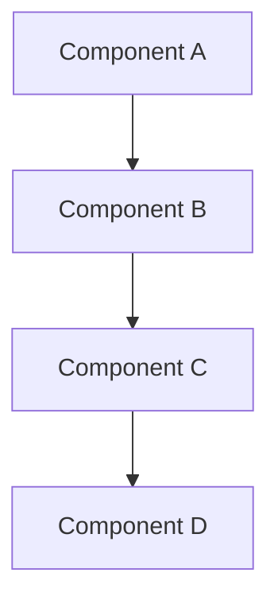

[!NOTE] Generate this report in user's own language.

# <!-- Report Title -->

- **Research Date:** <!-- YYYY-MM-DD -->
- **Timestamp:** <!-- ISO 8601 -->
- **Confidence Level:** <!-- High/Medium/Low -->
- **Subject:** <!-- Subject description -->

---

## Repository Information

- **Name:** <!-- repo name -->
- **Description:** <!-- repo description -->
- **URL:** <!-- repo URL -->
- **Stars:** <!-- star count -->
- **Forks:** <!-- fork count -->
- **Open Issues:** <!-- issue count -->
- **Language(s):** <!-- languages -->
- **License:** <!-- license type -->
- **Created At:** <!-- creation date -->
- **Updated At:** <!-- last update -->
- **Pushed At:** <!-- last push -->
- **Topics:** <!-- repo topics -->

---

## Executive Summary

<!-- 2-3 sentence overview with key metrics -->
<!-- Include inline citations: [citation:Title](URL) -->

---

## Complete Chronological Timeline

### PHASE 1: <!-- Phase name -->

<!-- Phase period and content with citations -->

### PHASE 2: <!-- Phase name -->

<!-- Phase period and content with citations -->

### PHASE 3: <!-- Phase name -->

<!-- Phase period and content with citations -->

---

## Key Analysis

<!-- Support each analysis point with inline citations -->

### <!-- Analysis Section 1 Title -->

<!-- Analysis content -->

### <!-- Analysis Section 2 Title -->

<!-- Analysis content -->

---

## Architecture / System Overview

<!-- Architecture description -->

---

## Metrics & Impact Analysis

### Growth Trajectory

<!-- Metrics timeline -->

### Key Metrics

| Metric | Value | Assessment |
|--------|-------|------------|
| <!-- metric --> | <!-- value --> | <!-- assessment --> |

---

## Comparative Analysis

### Feature Comparison

| Feature | Subject | Competitor 1 | Competitor 2 |
|---------|---------|--------------|--------------|
| <!-- feature --> | <!-- value --> | <!-- value --> | <!-- value --> |

### Market Positioning

<!-- Market positioning analysis -->

---

## Strengths & Weaknesses

### Strengths

<!-- Strengths with evidence -->

### Areas for Improvement

<!-- Weaknesses with evidence -->

---

## Key Success Factors

<!-- Success factors analysis -->

---

## Sources

### Primary Sources

<!-- Primary sources list -->

### Media Coverage

<!-- Media sources list -->

### Academic / Technical Sources

<!-- Academic/technical sources -->

### Community Sources

<!-- Community sources -->

---

## Confidence Assessment

**High Confidence (90%+) Claims:**
<!-- High confidence claims with evidence -->

**Medium Confidence (70-89%) Claims:**
<!-- Medium confidence claims -->

**Lower Confidence (50-69%) Claims:**
<!-- Lower confidence claims -->

---

## Research Methodology

This report was compiled using:

1. **Multi-source web search** - Broad discovery and targeted queries
2. **GitHub repository analysis** - Commits, issues, PRs, activity metrics
3. **Content extraction** - Official docs, technical articles, media coverage
4. **Cross-referencing** - Verification across independent sources
5. **Chronological reconstruction** - Timeline from timestamped data
6. **Confidence scoring** - Claims weighted by source reliability

**Research Depth:** <!-- depth level -->
**Time Scope:** <!-- time period covered -->
**Geographic Scope:** <!-- geographic scope -->

---

**Report Prepared By:** DeerFlow Research Engine (Claude Code Plugin)
**Date:** <!-- report date -->
**Report Version:** 1.0
**Status:** Complete
