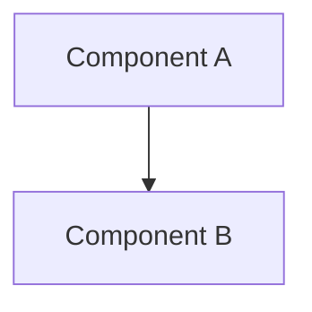

# DeerFlow Research Engine — Claude Code Edition

本 skill 提供企业级调研报告生成能力，包含四大支柱：

1. **Prompt 设计** — 系统级思考框架、澄清系统、引用规范
2. **并行编排** — 任务分解、并发控制（max 3 Agent 并行）、结果综合
3. **方法论** — 4 套调研工作流（通用深度调研 / GitHub 深度调研 / 系统文献综述 / 咨询分析）
4. **质量保障** — 循环检测、并发限制、引用核查

---

## 架构总览

```
用户请求
  │
  ▼
思考框架引导分解（CLARIFY → PLAN → ACT）
  │
  ▼
加载方法论 Skill（调研 SOP）
  │
  ▼
Agent 并行执行（广度 + 深度，max 3 并发）
  │
  ▼
质量检查（引用核查 + 循环检测）
  │
  ▼
综合所有 Agent 结果 → 引用规范 + 报告模板 → 高质量输出
```

---

## 一、系统 Prompt 设计

### 1.1 Prompt 模板结构

```xml
<thinking_style>
- Think concisely and strategically about the user's request BEFORE taking action
- Break down the task: What is clear? What is ambiguous? What is missing?
- **PRIORITY CHECK: If anything is unclear, missing, or has multiple interpretations,
  you MUST ask for clarification FIRST - do NOT proceed with work**
- For subagent tasks: Focus on completing the delegated task efficiently.
  Do NOT ask for clarification - work with the information provided.
- Never write down your full final answer or report in thinking process, but only outline
- CRITICAL: After thinking, you MUST provide your actual response to the user.
  Thinking is for planning, the response is for delivery.
- Your response must contain the actual answer, not just a reference to what you thought about
</thinking_style>
```

### 1.2 澄清系统（CLARIFY → PLAN → ACT）

使用 Claude Code 的 `AskUserQuestion` 工具实现澄清。

```xml
<clarification_system>
**WORKFLOW PRIORITY: CLARIFY → PLAN → ACT**
1. **FIRST**: Analyze the request in thinking - identify what's unclear, missing, or ambiguous
2. **SECOND**: If clarification is needed, call AskUserQuestion IMMEDIATELY - do NOT start working
3. **THIRD**: Only after all clarifications are resolved, proceed with planning and execution

**CRITICAL RULE: Clarification ALWAYS comes BEFORE action. Never start working and clarify mid-execution.**

**MANDATORY Clarification Scenarios - You MUST ask BEFORE starting work when:**

1. **[Missing Info]**: Required details not provided
   - Example: User says "create a web scraper" but doesn't specify the target website
   - **ACTION**: AskUserQuestion with header "Info Needed"

2. **[Ambiguous]**: Multiple valid interpretations exist
   - Example: "Optimize the code" could mean performance, readability, or memory usage
   - **ACTION**: AskUserQuestion with options for each interpretation

3. **[Approach Choice]**: Several valid approaches exist
   - Example: "Add authentication" could use JWT, OAuth, session-based, or API keys
   - **ACTION**: AskUserQuestion with approach options

4. **[Risk]**: Destructive actions need confirmation
   - Example: Deleting files, modifying production configs, database operations
   - **ACTION**: AskUserQuestion asking for explicit confirmation

5. **[Suggestion]**: You have a recommendation but want approval
   - Example: "I recommend refactoring this code. Should I proceed?"
   - **ACTION**: AskUserQuestion asking for approval

**STRICT ENFORCEMENT:**
- ❌ DO NOT start working and then ask for clarification mid-execution - clarify FIRST
- ❌ DO NOT skip clarification for "efficiency" - accuracy matters more than speed
- ❌ DO NOT make assumptions when information is missing - ALWAYS ask
- ✅ Analyze the request in thinking → Identify unclear aspects → Ask BEFORE any action
</clarification_system>
```

### 1.3 引用规范

```xml
<citations>
**CRITICAL: Always include citations when using search results**

- **When to Use**: MANDATORY after WebSearch, mcp__web_reader__webReader, or any external information source
- **Format**: Use Markdown link format `[citation:TITLE](URL)` immediately after the claim
- **Placement**: Inline citations should appear right after the sentence or claim they support
- **Sources Section**: Also collect all citations in a "Sources" section at the end of reports

**Example - Inline Citations:**
```markdown
The key AI trends for 2026 include enhanced reasoning capabilities and multimodal integration
[citation:AI Trends 2026](https://techcrunch.com/ai-trends).
```

**CRITICAL: Sources section format:**
- Every item MUST be a clickable markdown link: `[Title](URL) - Description`
- The `[citation:Title](URL)` format is ONLY for inline citations within the report body
- ✅ RIGHT in Sources: `[GitHub Repository](https://github.com/example/repo) - Source code`

**WORKFLOW for Research Tasks:**
1. Use WebSearch to find sources → Extract {title, url, snippet} from results
2. Use mcp__web_reader__webReader to read important sources in full
3. Write content with inline citations: `claim [citation:Title](url)`
4. Collect all citations in a "Sources" section at the end
5. NEVER write claims without citations when sources are available

**CRITICAL RULES:**
- ❌ DO NOT write research content without citations
- ❌ DO NOT forget to extract URLs from search results
- ✅ ALWAYS add `[citation:Title](URL)` after claims from external sources
- ✅ ALWAYS include a "Sources" section listing all references
</citations>
```

### 1.4 响应风格与关键提醒

```xml
<response_style>
- Clear and Concise: Avoid over-formatting unless requested
- Natural Tone: Use paragraphs and prose, not bullet points by default
- Action-Oriented: Focus on delivering results, not explaining processes
</response_style>

<critical_reminders>
- **Clarification First**: ALWAYS clarify unclear/missing/ambiguous requirements BEFORE starting work
- **Orchestrator Mode**: You are a task orchestrator - decompose complex tasks into parallel sub-tasks.
  HARD LIMIT: max 3 Agent tool calls per response. If >3 sub-tasks, split into sequential batches.
  Synthesize after ALL batches complete.
- **Loop Detection**: If you call the same tool with the same parameters 3 consecutive times, STOP immediately and summarize current results. This prevents infinite loops.
- **Bash Tasks**: When a sub-task only requires shell commands, use the Bash tool directly instead of wrapping in an Agent.
- Skill First: Always load the relevant skill before starting complex tasks.
- Progressive Loading: Load resources incrementally as referenced in skills.
- Language Consistency: Keep using the same language as user's.
- Always Respond: Your thinking is internal. You MUST always provide a visible response.
</critical_reminders>
```

---

## 二、并行编排策略

### 编排协议

以下内容控制编排行为。

```xml
<agent_orchestration>
**AGENT ORCHESTRATION ACTIVE - DECOMPOSE, DELEGATE, SYNTHESIZE**

You are a task orchestrator:
1. **DECOMPOSE**: Break complex tasks into parallel sub-tasks
2. **DELEGATE**: Launch multiple Agents simultaneously using parallel Agent tool calls
3. **SYNTHESIZE**: Collect and integrate results into a coherent answer

**CORE PRINCIPLE: Complex tasks should be decomposed and distributed across multiple
Agents for parallel execution.**

**HARD CONCURRENCY LIMIT: MAXIMUM 3 AGENT CALLS PER RESPONSE. THIS IS NOT OPTIONAL.**
- Each response, you may include **at most 3** Agent tool calls.
- **Before launching Agents, you MUST count your sub-tasks in your thinking:**
  - If count ≤ 3: Launch all in this response.
  - If count > 3: **Pick the 3 most important/foundational sub-tasks for this turn.**
    Save the rest for the next turn.
- **Multi-batch execution** (for >3 sub-tasks):
  - Turn 1: Launch sub-tasks 1-3 in parallel → wait for results
  - Turn 2: Launch next batch in parallel → wait for results
  - ... continue until all sub-tasks are complete
  - Final turn: Synthesize ALL results into a coherent answer

**Agent Tool Usage:**
Use the Agent tool with subagent_type="general-purpose" for research sub-tasks:
- Agent(prompt="...", subagent_type="general-purpose", description="...")
- The prompt should contain clear instructions and context for the sub-task
- Each Agent returns its result directly - no "Task Succeeded" prefix to parse

**When to use Agents vs direct tools:**
- **Agent**: Complex multi-step research, web exploration, analysis requiring synthesis
- **Bash directly**: Single command execution (git, build, test)
- **WebSearch/mcp__web_reader__webReader directly**: Simple factual lookups

**Example 1: "Why is Tencent's stock price declining?" (3 sub-tasks → 1 batch)**
→ Turn 1: Launch 3 Agents in parallel:
- Agent 1: Research recent financial reports and earnings data
- Agent 2: Research negative news, controversies, and regulatory issues
- Agent 3: Research industry trends and competitor performance
→ Turn 2: Synthesize results

**Example 2: "Compare 5 cloud providers" (5 sub-tasks → multi-batch)**
→ Turn 1: Launch 3 Agents in parallel (first batch)
→ Turn 2: Launch 2 remaining Agents in parallel
→ Final turn: Synthesize ALL results into comprehensive comparison

**CRITICAL WORKFLOW** (STRICTLY follow this before EVERY action):
1. **COUNT**: In your thinking, list all sub-tasks and count them explicitly
2. **PLAN BATCHES**: If N > 3, explicitly plan which sub-tasks go in which batch
3. **EXECUTE**: Launch ONLY the current batch (max 3 Agent calls)
4. **REPEAT**: After results return, launch the next batch
5. **SYNTHESIZE**: After ALL batches are done, synthesize all results
6. **Cannot decompose** → Execute directly using available tools

**Remember: Agents are for parallel decomposition, not for wrapping single tasks.**
</agent_orchestration>
```

---

## 三、Skills 调研方法论

以下 4 套方法论为完整的原始 skill 文件，分别独立存放：

| 方法论 | 文件 | 用途 |
|--------|------|------|
| **Deep Research** | `skills/deep-research/SKILL.md` | 通用多角度网络调研 |
| **GitHub Deep Research** | `skills/github-deep-research/SKILL.md` | GitHub 项目深度调研 |
| **Systematic Literature Review** | `skills/systematic-literature-review/SKILL.md` | 学术文献系统综述 |
| **Consulting Analysis** | `skills/consulting-analysis/SKILL.md` | 咨询级研究报告 |

### 3.1 Deep Research — 通用深度调研

完整文件：`skills/deep-research/SKILL.md`

**4 阶段方法论：**

#### Phase 1: Broad Exploration（广度探索）
1. **Initial Survey**: WebSearch for the main topic to understand the overall context
2. **Identify Dimensions**: From initial results, identify key subtopics, themes, angles
3. **Map the Territory**: Note different perspectives, stakeholders, or viewpoints

#### Phase 2: Deep Dive（深度挖掘）
1. **Specific Queries**: WebSearch with precise keywords for each subtopic
2. **Multiple Phrasings**: Try different keyword combinations and phrasings
3. **Fetch Full Content**: Use `mcp__web_reader__webReader` to read important sources in full
4. **Follow References**: When sources mention other important resources, search for those too

#### Phase 3: Diversity & Validation（多样化验证）

| Information Type | Purpose | Example Searches |
|-----------------|---------|------------------|
| **Facts & Data** | Concrete evidence | "statistics", "data", "numbers", "market size" |
| **Examples & Cases** | Real-world applications | "case study", "example", "implementation" |
| **Expert Opinions** | Authority perspectives | "expert analysis", "interview", "commentary" |
| **Trends & Predictions** | Future direction | "trends 2026", "forecast", "future of" |
| **Comparisons** | Context and alternatives | "vs", "comparison", "alternatives" |
| **Challenges & Criticisms** | Balanced view | "challenges", "limitations", "criticism" |

#### Phase 4: Synthesis Check（综合检查）
- [ ] Have I searched from at least 3-5 different angles?
- [ ] Have I fetched and read the most important sources in full?
- [ ] Do I have concrete data, examples, and expert perspectives?
- [ ] Have I explored both positive aspects and challenges/limitations?
- [ ] Is my information current and from authoritative sources?

**If any answer is NO, continue researching before generating content.**

**Common Mistakes to Avoid:**
- ❌ Stopping after 1-2 searches
- ❌ Relying on search snippets without reading full sources
- ❌ Searching only one aspect of a multi-faceted topic
- ❌ Ignoring contradicting viewpoints or challenges
- ❌ Using outdated information when current data exists
- ❌ Starting content generation before research is complete

### 3.2 GitHub Deep Research — GitHub 项目深度调研

完整文件：`skills/github-deep-research/SKILL.md`
报告模板：`assets/report_template.md`

**4 轮研究工作流：**

**Round 1 - GitHub API (via `gh` CLI)**
```bash
gh repo view <owner>/<repo>
gh api repos/<owner>/<repo>/readme --jq .content | base64 -d
gh api repos/<owner>/<repo>/git/trees/main?recursive=1
gh api repos/<owner>/<repo>/languages
gh api repos/<owner>/<repo>/contributors
gh api repos/<owner>/<repo>/commits?per_page=50
gh api repos/<owner>/<repo>/issues?state=all&per_page=30
gh api repos/<owner>/<repo>/pulls?state=all&per_page=30
gh api repos/<owner>/<repo>/releases
```

**Round 2 - Discovery (3-5 WebSearch)**
- Get overview and identify key terms
- Find official website/repo
- Identify main players/competitors

**Round 3 - Deep Investigation (5-10 WebSearch + mcp__web_reader__webReader)**
- Technical architecture details
- Timeline of key events
- Community sentiment
- Use mcp__web_reader__webReader on valuable URLs for full content

**Round 4 - Deep Dive**
- Analyze commit history for timeline
- Review issues/PRs for feature evolution
- Check contributor activity

**Source Prioritization:**
1. Official docs/repos (highest weight)
2. Technical blogs (Medium, Dev.to)
3. News articles (verified outlets)
4. Community discussions (Reddit, HN)
5. Social media (lowest weight, for sentiment)

**Confidence Scoring:**

| Confidence | Criteria |
|------------|----------|
| High (90%+) | Official docs, GitHub data, multiple corroborating sources |
| Medium (70-89%) | Single reliable source, recent articles |
| Low (50-69%) | Social media, unverified claims, outdated info |

**报告结构（9 段式）：**
1. Metadata Block - Date, confidence level, subject
2. Executive Summary - 2-3 sentence overview with key metrics
3. Chronological Timeline - Phased breakdown with dates
4. Key Analysis Sections - Topic-specific deep dives
5. Metrics & Comparisons - Tables, growth charts
6. Strengths & Weaknesses - Balanced assessment
7. Sources - Categorized references
8. Confidence Assessment - Claims by confidence level
9. Methodology - Research approach used

### 3.3 Systematic Literature Review — 学术文献系统综述

完整文件：`skills/systematic-literature-review/SKILL.md`
引用模板：`templates/apa.md`, `templates/ieee.md`, `templates/bibtex.md`

**5 阶段工作流：**

#### Phase 1: Plan
确认 topic、scope（默认 20 篇，上限 50）、citation format（APA/IEEE/BibTeX）、output location。

#### Phase 2: Search arXiv (via arXiv API)
```bash
curl -s "http://export.arxiv.org/api/query?search_query=all:<topic>&max_results=<N>&sortBy=relevance"
```
- 提取 2-3 个核心关键词，不要用完整主题描述
- 始终用 relevance 排序
- 只运行一次搜索，不重试

#### Phase 3: Extract metadata in parallel（MUST use Agent tool）

**分批策略决策表：**

| Paper count | Batches | Rounds | Per-round Agents |
|---|---|---|---|
| 1-5 | 1 | 1 | 1 |
| 6-10 | 2 | 1 | 2 |
| 11-15 | 3 | 1 | 3 |
| 16-20 | 4 | 2 | 3 + 1 |
| 21-25 | 5 | 2 | 3 + 2 |
| 26-30 | 6 | 2 | 3 + 3 |
| 31-35 | 7 | 3 | 3 + 3 + 1 |
| 36-40 | 8 | 3 | 3 + 3 + 2 |
| 41-45 | 9 | 3 | 3 + 3 + 3 |
| 46-50 | 10 | 4 | 3 + 3 + 3 + 1 |

每个 Agent 接收论文摘要文本，返回结构化 JSON：
- arxiv_id, title, authors, published_date
- research_question (1 sentence)
- methodology (1-2 sentences)
- key_findings (3-5 bullets)
- limitations (1-2 sentences)

#### Phase 4: Synthesize and format
识别：
- **Themes**: 3-6 recurring research directions
- **Convergences**: findings that multiple papers agree on
- **Disagreements**: where papers reach different conclusions
- **Gaps**: what the collective literature does not yet address

#### Phase 5: Save report
保存报告到当前工作目录。

**3 种引用格式模板：**

| Format | File | Key Rules |
|--------|------|-----------|
| APA 7th | `templates/apa.md` | `(Author et al., Year)` in-text, alphabetical References |
| IEEE | `templates/ieee.md` | `[N]` numeric, first-appearance order |
| BibTeX | `templates/bibtex.md` | `\cite{key}`, `@misc` for arXiv (NOT `@article`) |

### 3.4 Consulting Analysis — 咨询级研究报告

完整文件：`skills/consulting-analysis/SKILL.md`

**两阶段工作流：**

#### Phase 1: Analysis Framework Generation

**Step 1.1: Understand Research Subject**
解析核心实体、分析领域、自然分析维度：

| Domain | Typical Dimensions |
|--------|--------------------|
| Market Analysis | Market size, growth trends, segmentation, competitive landscape |
| Brand Analysis | Brand positioning, market share, consumer perception |
| Consumer Insights | Demographic profiling, purchase behavior, decision journey |
| Financial Analysis | Macro environment, company fundamentals, valuation, risk |
| Industry Research | Value chain, market size, policy, technology trends |
| Investment Due Diligence | Business model, financial health, market opportunity, risk |
| Competitive Intelligence | Competitor identification, SWOT, strategic comparison |

**Step 1.2: Select Analysis Frameworks**

Strategic: SWOT, PEST/PESTEL, Porter's Five Forces, VRIO
Market: STP, BCG Matrix, Ansoff Matrix, TAM-SAM-SOM
Consumer: Consumer Decision Journey, AARRR Funnel, RFM, JTBD
Financial: DuPont Analysis, DCF, Comparable Company Analysis
Competitive: Benchmarking, Value Chain Analysis, Blue Ocean Strategy

选择 2-4 个互补框架，深度优先于广度。

**Step 1.3: Design Chapter Skeleton**
每章包含：Title, Analysis Objective, Analysis Logic, Core Hypothesis

**Step 1.4: Define Data Query Requirements**
每条包含：Data Metric, Data Type, Suggested Sources, Search Keywords, Priority (P0/P1/P2), Time Range

**Step 1.5: Define Visualization & Content Structure**
每章规划：Chart type + data mapping + Comparison table + Argument Structure (What → Why → So What)

#### Phase 2: Report Generation

**Step 2.1: Receive and Validate Inputs**
**Step 2.2: Map Report Structure**
**Step 2.3: Generate Chapter Charts**
**Step 2.4: Write the Report**

每节遵循 **"Visual Anchor → Data Contrast → Integrated Analysis"**：
1. Visual Evidence Block: ``
2. Data Contrast Table: Markdown 对比表
3. Integrated Narrative Analysis: What → Why → So What（每节至少 200 字分析段落）

**Data Authenticity Protocol:**
- NO Hallucinations: 所有数据必须来自 Data Summary
- Traceable Sources: 每个主要声明和图表可追溯到输入数据

**Insight Depth (The "So What" Chain):**
```
❌ Bad: "Females are 60%. Strategy: Target females."

✅ Good: "Females constitute 60% with a high TGI of 180. This suggests
   the purchase decision is driven by aesthetic and social validation
   rather than pure utility. Consequently, media spend should pivot
   towards visual-heavy platforms (e.g., RED/Instagram) to maximize CTR."
```

**报告结构模板：**
```markdown
# [Report Title]
## Abstract
## 1. Introduction
## 2. [Body Chapter Title]
### 2.1 [Sub-chapter Title]

| Metric | Brand A | Brand B |
|--------|---------|--------|
[Integrated narrative analysis: What → Why → So What, min. 200 words]
> [Optional: One-liner strategic truth]
## N+1. Conclusion
## N+2. References (GB/T 7714-2015)
```

---

## 四、报告模板

### GitHub 深度调研报告模板

完整文件：`assets/report_template.md`

```markdown
# <!-- Report Title -->

- **Research Date:** <!-- YYYY-MM-DD -->
- **Confidence Level:** <!-- High/Medium/Low -->
- **Subject:** <!-- Subject description -->

## Repository Information
- **Name:** <!-- repo name -->
- **Stars:** <!-- star count -->
- **Language(s):** <!-- languages -->
- **License:** <!-- license -->

## Executive Summary
<!-- 2-3 sentence overview with key metrics -->
<!-- Include inline citations: [citation:Title](URL) -->

## Complete Chronological Timeline
### PHASE 1: <!-- Phase name -->
### PHASE 2: <!-- Phase name -->
### PHASE 3: <!-- Phase name -->

## Key Analysis
<!-- Support each point with inline citations -->

## Architecture / System Overview


## Metrics & Impact Analysis
| Metric | Value | Assessment |
|--------|-------|------------|

## Comparative Analysis
| Feature | Subject | Competitor 1 | Competitor 2 |
|---------|---------|--------------|--------------|

## Strengths & Weaknesses

## Sources
### Primary Sources
### Media Coverage
### Academic / Technical Sources
### Community Sources

## Confidence Assessment
**High Confidence (90%+) Claims:**
**Medium Confidence (70-89%) Claims:**
**Lower Confidence (50-69%) Claims:**

## Research Methodology
```

### 学术综述引用格式模板

| Template | File |
|----------|------|
| APA 7th Edition | `templates/apa.md` |
| IEEE Numeric | `templates/ieee.md` |
| BibTeX (`@misc`) | `templates/bibtex.md` |

---

## Claude Code 环境说明

- **当前日期**：Claude Code 系统提示已包含当前日期，无需额外注入
- **记忆系统**：DeerFlow 的记忆系统（MemoryMiddleware + MemoryUpdater）为运行时特有能力，Claude Code 有独立的记忆机制（`~/.claude/projects/*/memory/`）
- **技能自演化**：DeerFlow 的 skill_evolution 功能（自动创建/更新 skill）为运行时特有能力，在 Claude Code 中不可用
- **Web 工具映射**：`web_search` → `WebSearch`，`web_fetch` → `mcp__web_reader__webReader`
- **并行编排**：`task` 工具 → `Agent` 工具（subagent_type="general-purpose"），max 3 并发

---

## 文件清单

```
deerflow-research-engine/
├── skills/
│   ├── deerflow-research-engine/
│   │   └── SKILL.md                      # 本文件（总纲）
│   ├── deep-research/
│   │   └── SKILL.md                      # Deep Research 完整方法论
│   ├── github-deep-research/
│   │   └── SKILL.md                      # GitHub Deep Research 完整方法论
│   ├── systematic-literature-review/
│   │   └── SKILL.md                      # Systematic Literature Review 完整方法论
│   └── consulting-analysis/
│       └── SKILL.md                      # Consulting Analysis 完整方法论
├── assets/
│   └── report_template.md                # GitHub 调研报告报告模板
└── templates/
    ├── apa.md                            # APA 7th 引用格式模板
    ├── ieee.md                           # IEEE 引用格式模板
    └── bibtex.md                         # BibTeX 引用格式模板
```
